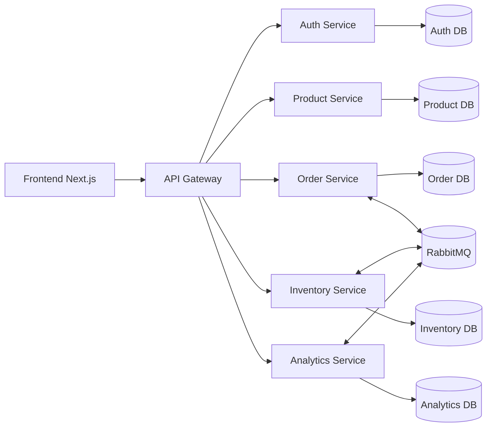

# Hệ thống POS quán cà phê theo kiến trúc microservices

Đây là MVP học thuật cho hệ thống bán hàng quán cà phê. Dự án thể hiện API Gateway, database riêng theo từng service, giao tiếp hướng sự kiện bằng RabbitMQ, Saga đơn giản giữa Order Service và Inventory Service, cùng CQRS cho thống kê.

## Công nghệ sử dụng

- Frontend: Next.js 15, TailwindCSS, React Query
- Backend: NestJS
- Cơ sở dữ liệu: PostgreSQL riêng cho từng service
- Message broker: RabbitMQ
- ORM: Prisma
- Môi trường chạy: Docker Compose

## Các service

| Service | Cổng | Vai trò |
| --- | ---: | --- |
| Frontend | 3005 | Giao diện bán hàng, tồn kho, thống kê, nhân sự, menu |
| API Gateway | 3000 | Điểm vào duy nhất, kiểm tra JWT, chuyển tiếp request |
| Auth Service | 3001 | Đăng nhập, JWT, người dùng, vai trò |
| Order Service | 3002 | Tạo đơn hàng và quản lý trạng thái Saga |
| Inventory Service | 3003 | Tồn kho, trừ kho, nhập kho, cảnh báo tồn thấp |
| Analytics Service | 3004 | Mô hình đọc CQRS từ các sự kiện RabbitMQ |
| Product Service | 3006 | Menu, giá, danh mục, trạng thái bán/tạm ẩn |
| RabbitMQ Management | 15672 | Giao diện quản lý message broker |
| pgAdmin | 5050 | Giao diện quản trị database |

## Kiến trúc hệ thống



## Luồng nghiệp vụ

1. Nhân viên đăng nhập.
2. Giao diện tải danh sách món đang bán từ Product Service thông qua Gateway.
3. Nhân viên chọn món và tạo đơn từ màn bán hàng.
4. Order Service lấy giá từ Product Service, tự tính tổng tiền và tạo đơn `PENDING`.
5. Order Service phát sự kiện `order.created`.
6. Inventory Service kiểm tra tồn kho.
7. Nếu đủ tồn, Inventory Service trừ kho và phát `inventory.reserved`.
8. Order Service cập nhật đơn thành `CONFIRMED` và phát `order.confirmed`.
9. Nếu thiếu tồn, Inventory Service phát `inventory.failed`.
10. Order Service cập nhật đơn thành `REJECTED` kèm lý do và phát `order.rejected`.
11. Analytics Service nhận sự kiện để cập nhật database thống kê riêng.

## Trạng thái đơn hàng

- `PENDING`: đơn vừa tạo, đang chờ kiểm tra tồn kho
- `CONFIRMED`: đã đủ tồn kho và đã trừ kho
- `COMPLETED`: nhân viên đánh dấu đơn đã phục vụ xong
- `REJECTED`: đơn bị từ chối do thiếu tồn kho hoặc món không có trong kho

## Event RabbitMQ

| Event | Service phát | Service nhận | Mục đích |
| --- | --- | --- | --- |
| `order.created` | Order Service | Inventory Service | Bắt đầu bước kiểm tra tồn kho |
| `inventory.reserved` | Inventory Service | Order Service | Xác nhận đủ tồn kho |
| `inventory.failed` | Inventory Service | Order Service | Từ chối đơn vì thiếu tồn |
| `order.confirmed` | Order Service | Analytics Service | Cập nhật doanh thu và món bán chạy |
| `order.rejected` | Order Service | Analytics Service | Đếm đơn bị từ chối |
| `order.completed` | Order Service | Analytics Service | Đếm đơn hoàn tất |
| `inventory.stock_imported` | Inventory Service | Mở rộng sau | Ghi nhận nhập kho |

## CQRS cho thống kê

Analytics Service không đọc trực tiếp database của Order Service. Service này nhận sự kiện từ RabbitMQ và tự duy trì mô hình đọc riêng:

- tổng doanh thu
- số đơn đã xác nhận
- số đơn hoàn tất
- số đơn bị từ chối
- món bán chạy

Thông tin tồn thấp được lấy từ Inventory Service và hiển thị trên dashboard như một chỉ số vận hành.

## Cách chạy

```bash
docker compose up --build
```

Nếu muốn chạy nền:

```bash
docker compose up --build -d
```

Nếu muốn reset sạch database và seed lại:

```bash
docker compose down -v
docker compose up --build
```

## Đường dẫn

- Frontend: http://localhost:3005
- Swagger Gateway: http://localhost:3000/api/docs
- Swagger Auth: http://localhost:3001/api/docs
- Swagger Order: http://localhost:3002/api/docs
- Swagger Inventory: http://localhost:3003/api/docs
- Swagger Analytics: http://localhost:3004/api/docs
- Swagger Product: http://localhost:3006/api/docs
- RabbitMQ UI: http://localhost:15672
- pgAdmin: http://localhost:5050

## Tài khoản demo

| Vai trò | Email | Mật khẩu |
| --- | --- | --- |
| Quản trị | `admin@example.com` | `123456` |
| Nhân viên | `barista@example.com` | `barista123` |

## Các màn hình chính

- `/pos`: bán hàng, chọn món, giỏ hàng, tạo đơn
- `/orders`: theo dõi trạng thái đơn và đánh dấu hoàn tất
- `/products`: quản lý menu, giá, danh mục, bật/tắt món
- `/inventory`: xem tồn kho, nhập kho, cảnh báo tồn thấp
- `/analytics`: doanh thu, số đơn, món bán chạy, tồn thấp
- `/staff`: quản lý tài khoản nhân sự

## Kịch bản demo khi bảo vệ

1. Đăng nhập bằng tài khoản admin.
2. Mở Menu để giải thích Product Service quản lý giá, danh mục và trạng thái bán.
3. Mở Bán hàng, chọn vài món và tạo đơn.
4. Giải thích phía máy chủ tự lấy giá từ Product Service, giao diện không quyết định giá.
5. Quan sát đơn từ `PENDING` chuyển sang `CONFIRMED`.
6. Mở Tồn kho để thấy số lượng bị trừ.
7. Đánh dấu đơn là `COMPLETED`.
8. Tạo đơn vượt quá số lượng tồn kho.
9. Quan sát đơn bị `REJECTED` kèm lý do.
10. Nhập kho cho một món tồn thấp.
11. Mở Thống kê để giải thích mô hình đọc CQRS.
12. Mở Swagger và RabbitMQ UI để chứng minh API/event flow.