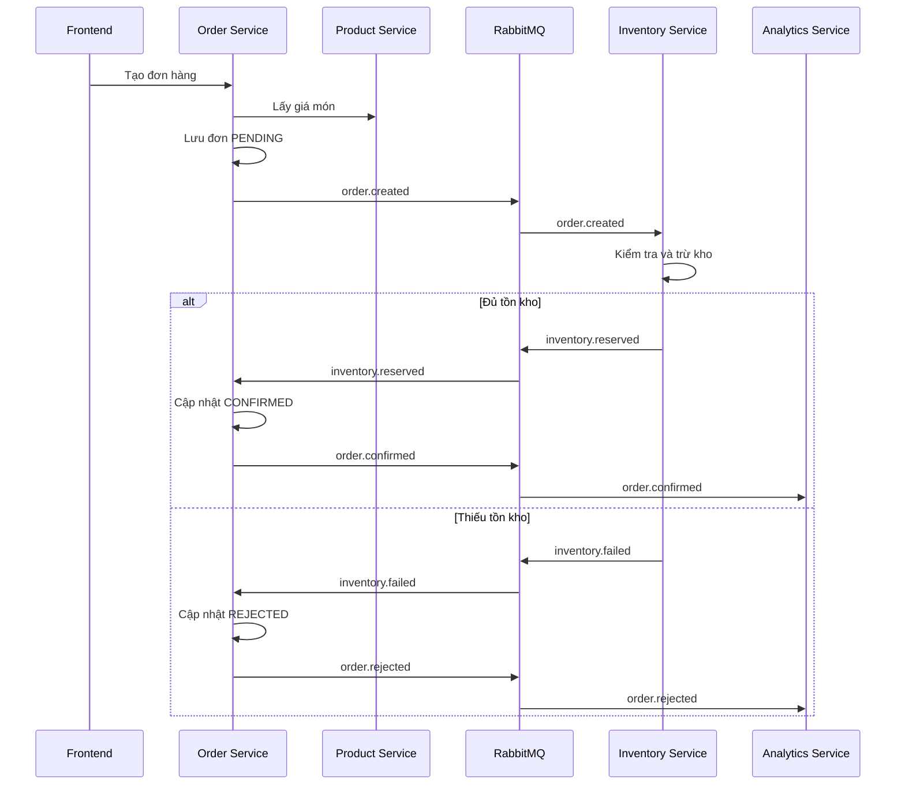

# Ghi chú kiến trúc

## Kiến trúc MVP cuối cùng

- API Gateway là điểm vào duy nhất cho giao diện.
- Mỗi service sở hữu database PostgreSQL riêng.
- RabbitMQ dùng cho giao tiếp bất đồng bộ bằng event.
- Order Service và Inventory Service triển khai Saga theo kiểu choreography.
- Analytics Service dùng CQRS bằng cách duy trì mô hình đọc từ sự kiện.

## Lý do scope phù hợp

Hệ thống đủ thực tế để demo nghiệp vụ bán hàng quán cà phê, nhưng không đưa vào các phần quá nặng cho đồ án như Kubernetes, distributed tracing, payment gateway hoặc outbox pattern.

## Saga

## CQRS

Order Service là mô hình ghi cho đơn hàng. Analytics Service là mô hình đọc riêng, được cập nhật bằng sự kiện RabbitMQ. Vì vậy Analytics không phụ thuộc trực tiếp vào database của Order Service.
